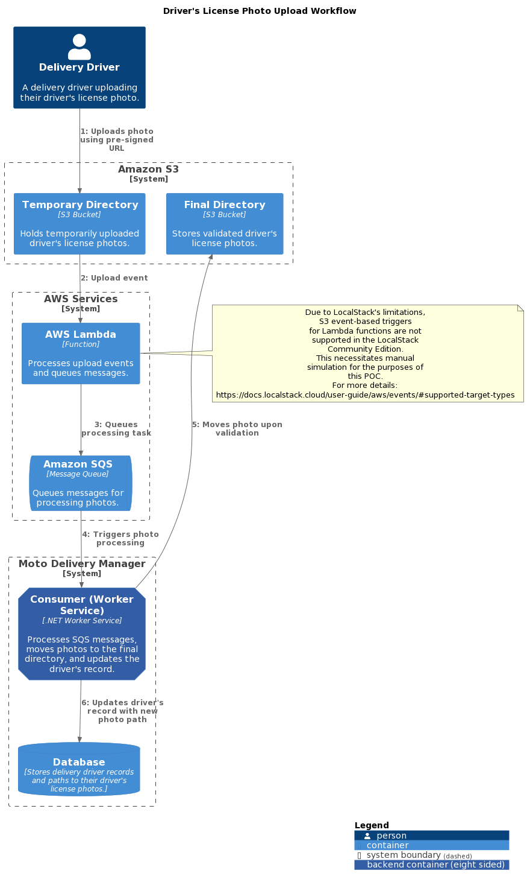

# Design Document: Driver's License Photo Upload System for Delivery Drivers

## Summary

This system enables delivery drivers to securely and efficiently upload photos of their driver's licenses directly to an AWS S3 environment, using pre-signed URLs. Designed to maximize security, scalability, and cost-efficiency, this upload process adheres to best practices in software architecture and technical documentation.

   
Table of Contents

   <ul>
      <li><a href="#diagram">Diagram</a></li>
      <li><a href="#system-components">System Components</a></li>
      <li><a href="#operation-flow">Operation Flow</a></li>
      <li><a href="#architectural-considerations">Architectural Considerations</a></li>
      <li><a href="#poc-with-localstack">POC with Localstack</a></li>
      <li><a href="#conclusion">Conclusion</a></li>
   </ul>

## Diagram

(<a href="#readme-top">back to top</a>)

Source: [Dynamic Diagram](dynamic-diagram.puml)

## System Components

(<a href="#readme-top">back to top</a>)

- **Amazon S3**: Hosts the driver's license photos of delivery drivers. Files are initially uploaded to a temporary directory and, upon successful validation, are moved to the final directory.
- **AWS Lambda**: Intends to propagate upload events to an SQS queue by processing the bucket name and object key. 
  - :warning: **Important Note**: Due to Localstack's limitations, S3 event-based triggers for Lambda functions are not directly supported. For more details on event types supported by Localstack, visit [Localstack Event Support](https://docs.localstack.cloud/user-guide/aws/events/#supported-target-types).
- **Amazon SQS**: Receives notifications about the processed driver's license photos, serving as a message queue for further actions within the workflow.
- **Consumer (Worker Services in .NET)**: Responsible for moving the processed photo to the final directory and updating the delivery driver's record with the new photo path information.
- **Localstack (Community)**: Simulates AWS services locally for the POC, focusing on initial development and testing. Noted limitations include the inability to simulate direct S3 event triggers for Lambda functions.

## Operation Flow

(<a href="#readme-top">back to top</a>)

1. **Driver's License Photo Upload**:
   - Delivery drivers are provided with a pre-signed URL for upload.
   - Photos are uploaded directly to S3, into a temporary directory (`/temp`), to minimize the load on the platform's infrastructure.

2. **Manual Simulation of Processing**:
   - Given Localstack’s limitations, S3 event-based triggers for Lambda functions are not supported.
   - The workflow is tested by manually sending a message (simulating Lambda's intended action) to the SQS queue using AWS CLI. The payload includes `bucketname` and `objectkey`.

3. **Processing by the Consumer**:
   - The Consumer, implemented as a Worker Service in .NET, listens to the SQS queue for new messages.
   - Upon receiving a message, it moves the validated driver's license photo from the temporary directory to the final directory (`/driver-licenses`).
   - It then updates the delivery driver’s record in the database with the new photo path.

## Architectural Considerations

(<a href="#readme-top">back to top</a>)

- **Separation of Directories**: Utilizing separate directories for temporary and final storage in S3 adds a layer of security and validation, ensuring only approved content reaches its final destination.
- **Consumer Implementation**: The choice to implement the Consumer as a Worker Service in .NET aligns with the system's need for reliability and scalability in processing photo uploads and updates.
- **Manual Simulation in Localstack**: Acknowledging Localstack's limitations, the POC includes manual steps to ensure the system's core functionality can be tested locally, paving the way for a smooth transition to the AWS environment.
- **SQS for Workflow Integration**: Leveraging SQS for communication ensures a decoupled, scalable architecture that can handle the asynchronous processing of driver's license photos effectively.

## POC with Localstack

(<a href="#readme-top">back to top</a>)

- This phase focuses on developing and testing the upload process and the manual simulation of the workflow, aiming to validate the proposed architecture and the interactions between components.
- The manual simulation of Lambda actions via AWS CLI to SQS serves as a workaround for known Localstack limitations regarding S3 event triggers, highlighting a pragmatic approach to testing.

## Conclusion

(<a href="#readme-top">back to top</a>)

This design document outlines the implementation of a secure and efficient upload system for delivery drivers to submit their driver's license photos. By incorporating a Consumer (Worker Services in .NET) for post-validation processing and manually simulating certain aspects due to Localstack limitations, the proposed system is well-prepared for production deployment in AWS, ensuring robustness and scalability.
