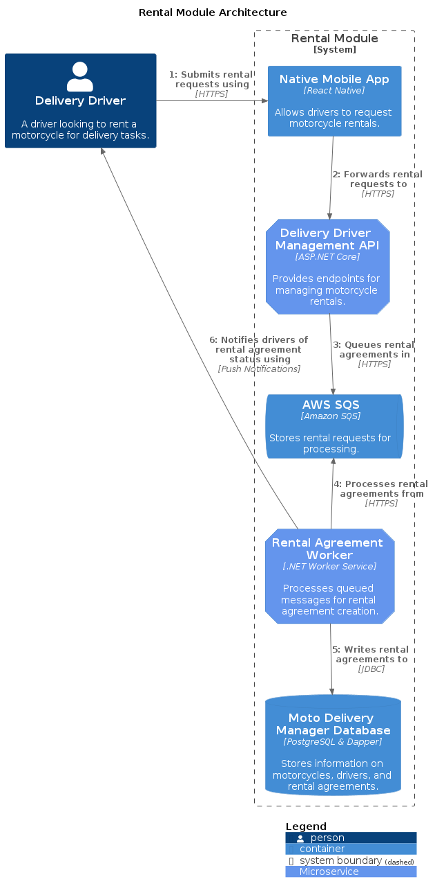

# Design Document: Rental Module for Moto Delivery Manager

## Summary

This design document outlines the implementation of the Rental Module within the Moto Delivery Manager system. This module aims to manage the entire lifecycle of motorcycle rentals for delivery drivers, from initiation and retal plain selection to the final calculation of rental costs. Utilizing .NET 8 and C# within a clean and hexagonal architecture framework, the module ensures a seamless, efficient, and secure process for both rental management and financial obligations.

   
Table of Contents

   <ul>
      <li><a href="#diagram">Diagram</a></li>
      <li><a href="#system-components">System Components</a></li>
      <li><a href="#operation-flow">Operation Flow</a></li>
      <li><a href="#architectural-considerations">Architectural Considerations</a></li>
      <li><a href="#implementation-details">Implementation Details</a></li>
      <li><a href="#conclusion">Conclusion</a></li>
   </ul>

## Diagram

(<a href="#design-doc-top">back to top</a>)

Source: [Component Diagram](./rental-module-component-diagram.puml)

## System Components

(<a href="#design-doc-top">back to top</a>)

- **Restful API**: Provides endpoints for rental management, including retal plans selection, motorcycle availability, and cost calculation.
- **Rental Agreement Worker**: Processes queued messages for rental agreement creation, verifying motorcycle availability and driver eligibility.
- **Database**: Stores information on motorcycles, drivers, rental agreements, and financial data. Utilizes Dapper for micro-ORM with PostgreSQL.
- **AWS SQS**: Queues messages for asynchronous processing, such as rental agreement creation. Ensures reliable and scalable communication between system components.

## Operation Flow

(<a href="#design-doc-top">back to top</a>)

1. **Rental Initiation**:
   - Delivery drivers select a rental plan through the Restful API, specifying the start date and expected end date, initiating the rental agreement process. The request is queued in AWS SQS for asynchronous processing.

2. **Motorcycle Availability and Driver Verification**:
   - Queued messages are processed, verifying motorcycle availability and driver eligibility based on the rental plan selected. If the motorcycle is available and the driver meets the requirements, the rental agreement is created; otherwise, the driver is notified of the issue.

3. **Rental Agreement Creation**:
   - A new rental agreement is created, detailing the motorcycle, rental plan, start date, and expected end date. The agreement is stored in the database for future reference, and the driver is notified of the successful rental initiation.

4. **Rental Termination and Cost Calculation**:
   - The delivery driver indicates the end of the rental period, triggering the calculation of the final rental cost based on the rental plan and any additional fees incurred. The total cost is then presented to the driver for payment.

## Architectural Considerations

(<a href="#design-doc-top">back to top</a>)

- Modular design within the system allows for clear separation of concerns, facilitating maintenance and future enhancements.
- The clean and hexagonal architecture ensures that core logic is decoupled from external interfaces, promoting flexibility and testability.
- Asynchronous processing with AWS SQS enhances system scalability and reliability, enabling efficient communication between system components.
- Database management with Dapper and PostgreSQL provides a robust and efficient solution for data storage and retrieval, ensuring data integrity and performance.

## Implementation Details

(<a href="#design-doc-top">back to top</a>)

### Key Use Cases

- **List Rental Plans**: Delivery drivers can view available rental plans and select the one that best suits their needs.
- **Queue Rental Agreement Request**: The system validates the rental agreement request, ensuring that information provided is accurate and complete. If no issues are detected, the request is queued for processing. Otherwise, the driver is notified of the error.
- **Register Rental Agreement**: Delivery drivers can initiate a rental agreement by selecting a rental plan and specifying the start and end dates. The system verifies motorcycle availability and driver eligibility before creating the agreement.
- **Calculate Rental Termination Cost**: Upon indicating the end of the rental period, the system calculates the final rental cost based on the rental plan and any additional fees incurred. The total cost is then presented to the delivery driver for payment.

### Technology Stack

- Backend development with .NET 8 and C#.
- Restful API development using ASP.NET Core.
- Asynchronous processing with AWS SQS.
- Database management with PostgreSQL and Dapper micro-ORM.
- Unit testing with xUnit and Moq.

## Conclusion

(<a href="#design-doc-top">back to top</a>)

The Rental Module is an essential component of the Moto Delivery Manager system, providing a seamless and efficient process for managing motorcycle rentals for delivery drivers. By leveraging .NET 8 and C# within a clean and hexagonal architecture framework, the module ensures a robust and scalable solution for rental management and financial obligations. With the integration of AWS SQS for asynchronous processing and PostgreSQL with Dapper for database management, the system delivers a reliable and performant solution for motorcycle rental operations.
