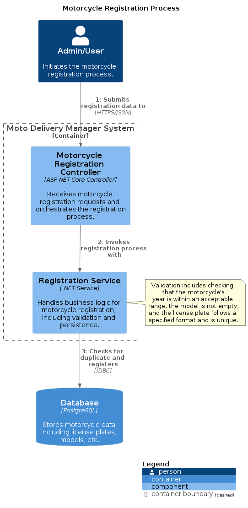
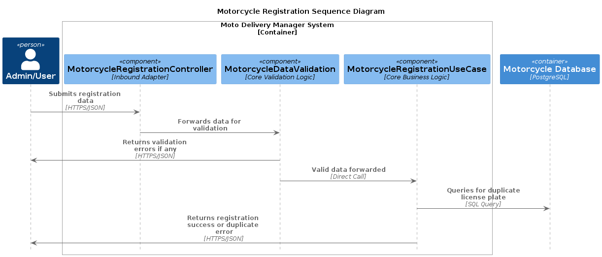

  
Table of Contents

  <ul>
    <li><a href="#overview">Overview</a></li>
    <li><a href="#specification">Use Case Specification</a></li>
    <li><a href="#diagrams">Diagrams</a>
        <ul>
          <li><a href="#component-diagram">Component Diagram</a></li>
          <li><a href="#sequence-diagram">Sequence Diagram</a></li>
        </ul>
    </li>
  </ul>

# Motorcycle Registration Use Case Documentation

## Overview

(<a href="#usecase-top">back to top</a>)

The `MotorcycleRegistrationUseCase` is a core functionality of the MotoDeliveryManager system, designed to facilitate the registration of motorcycles. This document outlines the process, data requirements, validations, and interactions involved in registering a motorcycle, adhering to the principles of Hexagonal and Clean Architecture.

## Use Case Specification

(<a href="#usecase-top">back to top</a>)

### Goal

To successfully register a new motorcycle within the MotoDeliveryManager system, ensuring that all necessary validations are passed and the motorcycle does not already exist in the system.

### Actors

- **Admin**: Initiates the motorcycle registration process through the system's interface.

### Pre-conditions

- The user initiating the registration must have administrative privileges.
- The system is operational and accessible.

### Post-conditions

- A new motorcycle record is created in the system if all validations are passed and the motorcycle does not already exist.

### Main Flow

1. The user submits motorcycle registration data, including the motorcycle's unique identifier, year of manufacture, model, and license plate.
2. The system validates the provided data against predefined rules.
3. If validation fails, the system reports the errors back to the user.
4. If validation passes, the system checks if a motorcycle with the same license plate already exists.
5. If a duplicate is found, the system informs the user about the duplication.
6. If no duplicate is found, the system registers the motorcycle and confirms the registration to the user.

### Alternative Flows

- **Data Validation Error**: Any validation error leads to the process being terminated, and detailed information about the failed validations is provided to the user.
- **Duplicate License Plate**: If a motorcycle with the provided license plate already exists, the process is terminated, and a duplication error is reported.

### Data Model

#### MotorcycleRegistrationInbound

- **MotorcycleId**: A GUID representing the unique identifier for the motorcycle.
- **Year**: An integer representing the year of manufacture of the motorcycle. Must be greater than 2000 and less than or equal to the current year.
- **Model**: A string representing the model of the motorcycle.
- **LicensePlate**: A string representing the motorcycle's license plate. It is unique and validated for format correctness.

### Validation Rules

- **MotorcycleId**: Must not be empty.
- **Year**: Must be within the valid range.
- **Model**: Must not be empty.
- **LicensePlate**: Must not be empty, must follow a valid format, and must be unique within the system.

### Interfaces

#### IMotorcycleRegistrationUseCase

- Handles the execution of the motorcycle registration process.
- Accepts `MotorcycleRegistrationInbound` data.
- Utilizes an `IMotorcycleRegistrationOutcomeHandler` to process outcomes.

#### IMotorcycleRegistrationOutcomeHandler

- Processes different outcomes of the registration process, such as `Duplicated`, `Invalid`, and `Registered`.

### Repository

#### IRegisterMotorcycleRepository

- Checks for the existence of a motorcycle by license plate.
- Registers a new motorcycle in the system.

## Diagrams

(<a href="#usecase-top">back to top</a>)

### Component Diagram

The following diagram illustrates the components involved in the motorcycle registration use case.

Source: [register-motorcycle-component-diagram.puml](./register-motorcycle-component-diagram.puml)

### Sequence Diagram

The following diagram illustrates the sequence of interactions involved in the motorcycle registration process.

Source: [register-motorcycle-sequence-diagram.puml](./register-motorcycle-sequence-diagram.puml)

